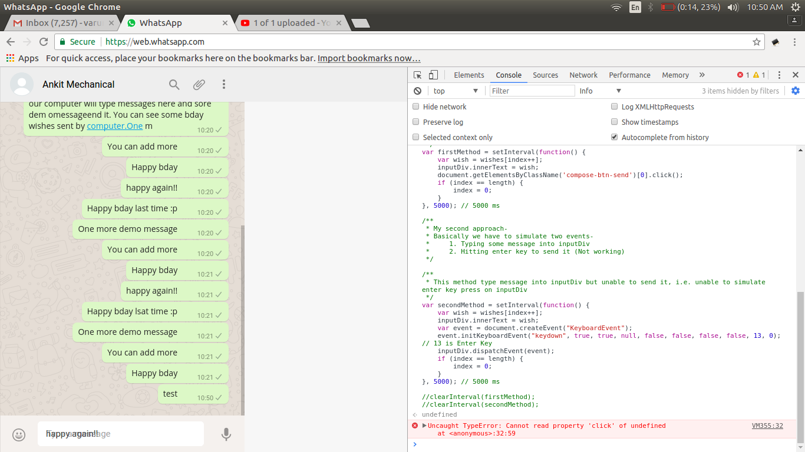
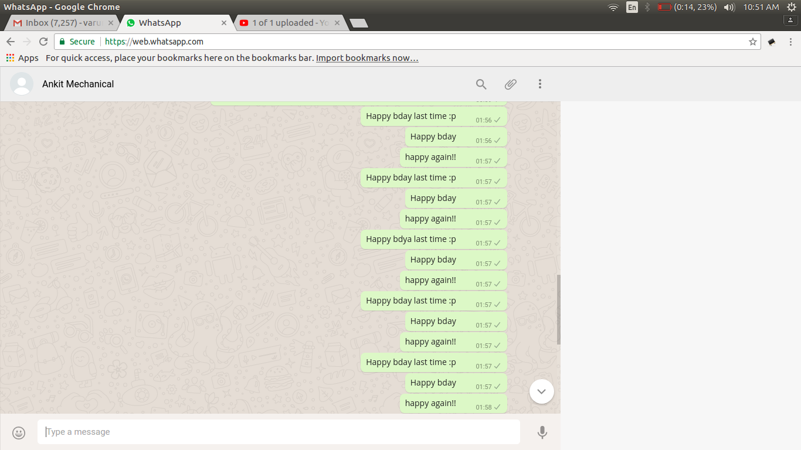

# WhatsappAutoMessenger
This tool is for pranking your friends😂. It will send messages to your friend on WhatsApp Web automatically at fixed interval (e.g. after every 5mins) while you
sleep and have good dream(s).

### How does it work?

1. You define your messages into Java class.
2. You open https://web.whatsapp.com/ and choose your best friend.
3. You open a terminal and compile + run Java class.
4. You go to sleep and have nice dreams.
5. On morning, your friend gets crazy seeing hundreds of messages😂

### You got excited??

1. Clone this Repository / Download zip
2. Open terminal (Ctrl + Alt + T)
3. Type `cd /path/to/repository`
4. Edit WhatsappAutoMessenger.java to define your messages (or you can test without editing) `vi WhatsappAutoMessenger.java`
5. Compile this class `javac WhatsappAutoMessenger.java`
6. Run it `java WhatsappAutoMessenger`
7. You can see your messages being typed on terminal (as per delay and repeat interval defined by you)
8. Go to https://web.whatsapp.com/ and choose your friend
9. Click on 'Type a message' input div (so that it achieves focus)
10. See the magic :smiling_imp:

### How did I make it

We can send whatsapp message from Android app or from whatsapp web. Making an automatic-message-sender Android app seemed
a lot of work to me. So I chose second way :relieved: . Initially I thought writing some javascript code in browser console
will do the work but I got stuck in middle. Idea is to simulate 'message-typing' and 'sending' like real user on WhatsApp
Web. To see this approach please see whatsapp.js file. If you get it working please do ping me :grin:

Since all I had to do is simulation, I can also do it on OS Level. I chose Java for it. I used ` java.awt.Robot` class 
for this purpose and this was my 2nd working approach. See Video to feel it.

#### What's next?

You can make a chatbot which will be able to respond to incoming messages wisely.

